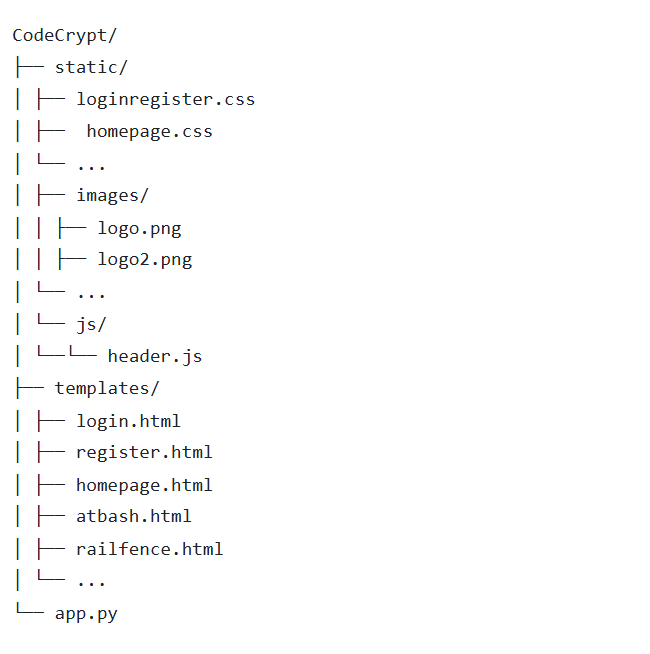

# CodeCrypt


CodeCrypt is a web application that provides secure encryption and decryption of text using various classical cipher methods, as well as data representation. Designed for cryptography enthusiasts, it features user authentication for managing encrypted data and an intuitive interface for hands-on experience with encryption techniques.

## Table of Contents
- [Features](#features)
- [Ciphers and Encoding Tools](#ciphers-and-encoding-tools)
- [System Architecture](#system-architecture)
- [Applied Computer Science Concept](#applied-computer-science-concept)
- [Algorithms Used](#algorithms-used)
- [Security Mechanisms](#security-mechanisms)
- [Development Process and Design Decisions](#development-process-and-design-decisions)
- [Correctness and Efficiency](#correctness-and-efficiency)
- [Installation/How to Run the Project](#installation)
- [Usage](#usage)
- [File Structure](#file-structure)
- [Contributors](#contributors)
- [Acknowledgement](#Acknowledgement)

---

## Features

### User Authentication
- Secure registration and login system using hashed passwords.
- Session-based authentication for personalized user experience.
- **Forgot Password**: Allows users to recover their account by resetting their password via email.

### Cryptography Tools
- Encode and decode text using classical or traditional ciphers and encoding schemes.
- Fun-to-use, friendly interface suitable for both practical applications and casual exploration of cryptography.

### User-Friendly Interface
- Intuitive design with a consistent layout for all cipher pages.
- Sidebars and headers for easy navigation.

### Favorites and History
- **Favorites**: Allow users to mark frequently used ciphers and tools as favorites for quick access.
- **History**: Track the user's recent encryption and decryption activities for easy reference and re-use. Includes options for **filtering** and **sorting** by:
  - Cipher type
  - Recent or oldest activity

### Profile Editing
- Users can manage and update their profile details, such as username, name, and password, ensuring a personalized experience.

### Dark Mode
- A dark mode feature for users who prefer a darker interface, reducing eye strain and providing a more comfortable viewing experience in low-light environments.

### Responsive Design
- Accessible across different desktop browsers, screens, and layouts.

---

## Ciphers and Encoding Tools
CodeCrypt supports the following tools:  
1. **Affine Cipher**  
2. **Atbash Cipher**  
3. **Base64 Encoding**  
4. **Binary Encoding**  
5. **Caesar Cipher**  
6. **Hexadecimal Encoding**  
7. **Morse Code**  
8. **Rail Fence Cipher**  
9. **ROT13 Cipher**  
10. **Vigenère Cipher**


Each cipher tool includes:  
- Input fields for plain text or encoded text.  
- Options to toggle between encryption and decryption.  
- Detailed results/conversion displayed in real-time.  

---

## System Architecture

CodeCrypt follows a **three-tier architecture**:
1. **Frontend**: Built using HTML, CSS, and JavaScript for user interaction and interface rendering.
2. **Backend**: Python (Flask) processes requests, applies cipher algorithms, and handles business logic.
3. **Database Layer**: MySQL stores user credentials, favorites, and history data, ensuring secure and efficient data management.


### Additional Technologies Used

- **Password Hashing**: Werkzeug
- **Email Handling**: Flask-Mail
- **Session Management**: Flask
- **Serialization**: ItsDangerous

---

## Applied Computer Science Concepts

### Cryptography
- Implements encryption and decryption methods for various classical ciphers.
- Provides hands-on exploration of secure data transformations.

### Algorithms and Computational Theory
- Demonstrates algorithmic design and complexity through cipher implementation.
- Focuses on efficiency and correctness in data transformation.

### Data Representation and Mathematical Principles
- Converts text into various formats, showcasing how information is structured and manipulated.
- Applies modular arithmetic, prime factorization, and linear equations in ciphers like Affine.

### Software Engineering
- Follows modular design and clean code practices.
- Integrates a web-based interface with Flask, showcasing real-world application development.

### Human-Computer Interaction
- Focuses on intuitive and accessible UI for cipher tools.
- Prioritizes user experience and ease of understanding for non-technical users.

---

## Algorithms Used

### Error Handling Across All Ciphers
- **Validation**: Ensures user input meets the requirements for each cipher (e.g., no unsupported characters or empty fields).
- **Error Message**: Displays a consistent error message for invalid inputs:  
  `"Error. Invalid input. Please enter again."`
- **Application**: Improves user experience by guiding users to correct their inputs.

### 1. **Affine Cipher**
- **Encryption**: `E(x) = (a * x + b) mod 26`
- **Decryption**: `D(y) = a^-1 * (y - b) mod 26`
- **Error Handling**: Checks that the key 'a' is coprime with 26 and validates input for unsupported characters.
- **Application**: Converts letters into numbers, applies mathematical transformations, and maps back to characters.

### 2. **Caesar Cipher**
- **Encryption**: Shifts characters by a fixed number.
- **Decryption**: Shifts characters backward by the same number.
- **Error Handling**: Ensures input text only includes valid characters (e.g., alphabets).
- **Application**: Simple substitution cipher, ideal for demonstrating shift-based encryption.

### 3. **Rail Fence Cipher**
- **Encryption**: Arranges characters diagonally across a set number of rails.
- **Decryption**: Reconstructs the original sequence by reversing the pattern.
- **Error Handling**: Validates that the number of rails is greater than 1 and input text is not empty.
- **Application**: Demonstrates permutation-based data transformation.

### 4. **Morse Code**
- **Encoding**: Maps characters to predefined sequences of dots and dashes.
- **Decoding**: Reverses the mapping to reconstruct text.
- **Error Handling**: Rejects invalid characters that do not map to Morse code.
- **Application**: Highlights text-to-symbol transformation.

### 5. **Vigenère Cipher**
- **Encryption**: Repeats the key to match text length and applies a character shift based on the key.
- **Decryption**: Reverses the process using the same key.
- **Error Handling**: Ensures the key contains only alphabets and matches the input text requirements.
- **Application**: Demonstrates polyalphabetic substitution.

### 6. **ROT13 Cipher**
- **Encryption/Decryption**: Shifts characters by 13 places (same operation for both).
- **Error Handling**: Ensures input text only includes valid alphabetic characters.
- **Application**: Quick substitution cipher for basic text obfuscation.

### 7. **Binary Encoding**
- **Encoding**: Converts text into binary sequences.
- **Decoding**: Reconstructs text from binary sequences.
- **Error Handling**: Ensures input text for decoding includes only '0' and '1'.
- **Application**: Demonstrates text-to-binary and binary-to-text transformations.

### 8. **Base64 Encoding**
- **Encoding**: Converts text into a Base64 representation.
- **Decoding**: Reconstructs text from Base64 encoding.
- **Error Handling**: Validates Base64 strings and input length for decoding.
- **Application**: Demonstrates encoding for safe data transfer.

### 9. **Hexadecimal Encoding**
- **Encoding**: Converts text into hexadecimal values.
- **Decoding**: Reconstructs text from hexadecimal values.
- **Error Handling**: Validates that input for decoding contains only hexadecimal characters.
- **Application**: Demonstrates text-to-hex and hex-to-text conversions.

### 10. **Atbash Cipher**
- **Encryption/Decryption**: Reverses the alphabet (e.g., 'A' becomes 'Z', 'B' becomes 'Y').
- **Error Handling**: Ensures input text includes only valid characters for transformation.
- **Application**: Demonstrates monoalphabetic substitution.

---

## Security Mechanisms

### 1. Password Security
- Passwords are hashed using `werkzeug.security` to ensure they are stored securely.
- Prevents plain text password storage, safeguarding user credentials.

### 2. Session Management
- Secure sessions are managed using Flask, preventing unauthorized access.

### 3. Data Validation
- Input data is validated to prevent injection attacks and other vulnerabilities.

### 4. Password Recovery
- Securely generated tokens are created for password recovery.
- The token is stored in the database and is valid for a limited time until it expires or becomes null.
- This token is used to verify the user's identity during the password reset process, adding a layer of security to prevent unauthorized access.

---

## Development Process and Design Decisions

The following is the key steps and methodologies followed during the creation of CodeCrypt: 
1. **User-Centric Design**
   - Emphasized accessibility and simplicity in interface design.

2. **Modular Development**
   - Each cipher tool was implemented as an independent module (backend logic and corresponding frontend page) to ensure maintainability and scalability.

3. **Clean Code Practices**
   - Followed PEP 8 standards for Python code and modularized CSS for consistent styling.

4. **Database Design**
   - Designed an optimized schema to ensure quick query execution and minimize redundancy through normalization and proper indexing.

5. **Iterative Testing**
   - Ensured correctness and efficiency of cipher algorithms through extensive testing.

Summary of the Development Process:
It starts with designing for user needs, progresses through modular implementation and coding best practices, includes database schema optimization, and ends with testing and debugging to deliver a polished product.

---

## Correctness and Efficiency

### Correctness

1. **Accurate Cipher Implementations**:  
   Ciphers (Affine, Atbash, Caesar, etc.) are implemented using well-established algorithms, ensuring the correctness of both encryption and decryption processes. Input is validated to handle invalid or empty entries properly.

2. **Input Validation**:  
   The app ensures that only valid data is processed (e.g., alphabetic characters for ciphers like Caesar). Feedback is provided for invalid input, ensuring the app behaves as expected even with incorrect or unsupported data.

3. **Edge Case Handling**:  
   The app accounts for edge cases such as empty input, unsupported characters, and inappropriate cipher key values, ensuring robust performance in all scenarios.

### Efficiency

1. **Optimized Cipher Algorithms**:  
   Ciphers are optimized for performance, ensuring fast processing even with large input sizes. Algorithms are designed with minimal time complexity to deliver quick results.

2. **Time Complexity**:  
   - Cipher functions generally have linear time complexity (O(n)), where 'n' is the length of the input text, ensuring efficient processing of large strings.
   - For example, the Rail Fence cipher operates with O(n) complexity for both encoding and decoding, ensuring smooth performance even with large text.

3. **Optimized UI for Smaller Screens**:  
   The app is designed to maintain smooth performance on devices with smaller screens, adapting to various screen sizes without sacrificing usability. Layouts are responsive, minimizing clutter and maximizing ease of use.

4. **Efficient UI Updates**:  
   UI updates are optimized to reduce resource consumption, ensuring quick result display even on smaller devices. Unnecessary re-renders are avoided, providing fast feedback to users.
   
---

## Installation
### Prerequisites
- [Python 3.x](https://www.python.org/)
- [Flask](https://flask.palletsprojects.com/)
- [MySQL Database](https://www.mysql.com/)
- [XAMPP](https://www.apachefriends.org/) (for MySQL setup)

### Steps
1. **Clone the Repository**  
   ```bash
   git clone https://github.com/lizaloraine/CodeCrypt.git
   cd CodeCrypt

2. **Set Up MySQL Database**
   - Create a database named CodeCrypt.
   - Use the SQL queries provided in the [schema.sql](schema.sql) file to set up the database tables.

3. **Install Dependencies**
   ```bash
   pip install flask flask-mysqldb werkzeug
   pip install Flask-Mail

4. **Run the Application**
   ```bash
   python app.py
- The application will be accessible at http://127.0.0.1:5000.

---

## Usage

### 1. Registration and Login
- **Register** with your name, email, username, and password.
- **Log in** to access the cipher tools.

### 2. Select a Cipher Tool
- Navigate through the **sidebar** or use the **card containers** on the homepage to select a cipher or encoding tool.
- Input the text that you want to **encrypt** or **decrypt** as needed.

### 3. Results
- The **results** of the encryption or decryption process will be displayed in a dedicated area beside the input field.

### 4. Favorites
- You can **mark** your frequently used ciphers as **favorites** for easy access later.
- These **favorites** will be displayed in a separate section for quick selection.

### 5. History
- The app keeps a **history** of your past operations.
- You can **view** and **filter** your history by **cipher type** or sort it by **newest** or **oldest** to revisit previous encryptions or decryptions.

### 6. Logout
- You can securely **log out** from the application when you're finished using it.

---

## File Structure

The directory structure of the CodeCrypt web application is as follows:


### Explanation:
- **`static/`**: Contains static files like CSS, images, and JavaScript.
  - Contains the stylesheets for the app, such as `loginregister.css`, `homepage.css`, and so on.
  - **`images/`**: This folder holds any image assets for the web app.
  - **`js/`**: Contains JavaScript file like `header.js` for any interactive components.
- **`templates/`**: Contains the HTML templates for the pages.
  - Files like `login.html`, `register.html`, `homepage.html`, etc., which are used for rendering different parts of the web app.
- **`app.py`**: The main Python script for running the Flask application and handling routes.

---

## Contributors

- **Project Author**: trioBytes Team
  - Ignacio, Liza Loraine M. as the *Project Manager/Fullstack Developer*
  - Balbuena, Jeff Lawrence C. as the *Frontend Developer*
  - Godoy, Hillarie R. as the *Backend Developer*

---

## Acknowledgements

- Special thanks to **Ms. Fatima Marie Agdon**, our instructor, for her guidance and support throughout the project development.
- Also, to our **loved ones**, **friends**, and **pets**, a heartfelt thanks for their constant support, comfort, patience, and inspiration throughout the project development journey.
- This project was developed as the **final project** for the **IT 314 - Web Systems and Technologies** course.
  
---
💖 trioBytes 2024
