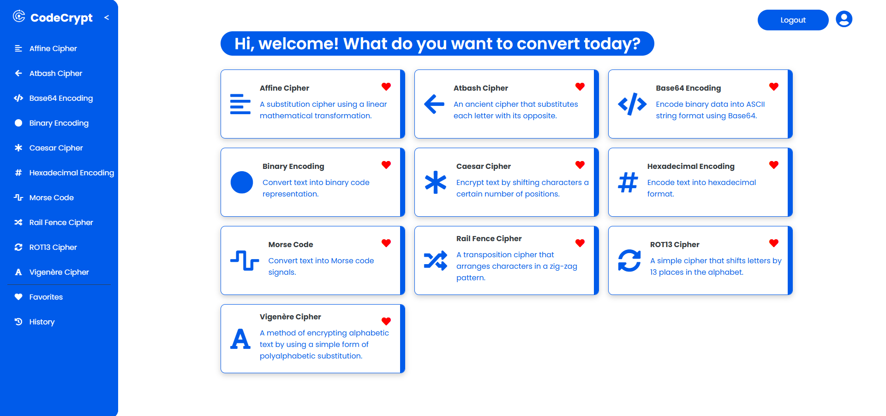

# CodeCrypt


CodeCrypt is a web application that provides secure encryption and decryption of text using various classical cipher methods, as well as data representation. Designed for cryptography enthusiasts, it features user authentication for managing encrypted data and an intuitive interface for hands-on experience with encryption techniques.

## Table of Contents
- [Features](#features)
- [Ciphers and Encoding Tools](#ciphers-and-encoding-tools)
- [Installation](#installation)
- [Usage](#usage)
- [File Structure](#file-structure)
- [Technologies Used](#technologies-used)
- [Future Enhancements](#future-enhancements)
- [Contributing](#contributing)
- [License](#license)

---

## Features
- **User Authentication**  
  - Secure registration and login system using hashed passwords.  
  - Session-based authentication for personalized user experience.  

- **Cryptography Tools**  
  - Encode and decode text using classical or traditional ciphers and encoding schemes.  
  - Fun-to-use, friendly interface suitable for both practical applications and casual exploration of cryptography.

- **User-Friendly Interface**  
  - Intuitive design with a consistent layout for all cipher pages.  
  - Sidebars and headers for easy navigation.  

- **Responsive Design**  
  - Accessible across devices with mobile-friendly layouts.  

---

## Ciphers and Encoding Tools
CodeCrypt supports the following tools:  
1. **Affine Cipher**  
2. **Atbash Cipher**  
3. **Base64 Encoding**  
4. **Binary Encoding**  
5. **Caesar Cipher**  
6. **Hexadecimal Encoding**  
7. **Morse Code**  
8. **Rail Fence Cipher**  
9. **ROT13 Cipher**  
10. **Vigenère Cipher**



Each cipher tool includes:  
- Input fields for plain text or encoded text.  
- Options to toggle between encryption and decryption.  
- Detailed results displayed in real-time.  

---

## Installation
### Prerequisites
- [Python 3.x](https://www.python.org/)
- [Flask](https://flask.palletsprojects.com/)
- [MySQL Database](https://www.mysql.com/)
- [XAMPP](https://www.apachefriends.org/) (for MySQL setup)

### Steps
1. **Clone the Repository**  
   ```bash
   git clone https://github.com/lizaloraine/CodeCrypt.git
   cd CodeCrypt

2. **Set Up MySQL Database**
   - Create a database named CodeCrypt.
   - Use the SQL queries provided in the [schema.sql](schema.sql) file to set up the database tables.

3. **Install Dependencies**
   ```bash
   pip install flask flask-mysqldb werkzeug
   pip install Flask-Mail

4. **Run the Application**
   ```bash
   python app.py
- The application will be accessible at http://127.0.0.1:5000.

---

## Usage
- **Registration and Login**
  - Register with your name, email, username, and password.
  - Log in to access cipher tools.

- **Select a Cipher Tool**
  - Navigate through the sidebar (or the card containers in the homepage) to select a cipher or encoding tool.
  - Input the text to encrypt or decrypt as needed.
    
- **Results**
  - Results are displayed in a dedicated area beside the input.

- **Logout**
  - Securely log out from the application when finished.

---

## File Structure

The directory structure of the CodeCrypt web application is as follows:

CodeCrypt/
├── static/
│ ├── css/ 
│ │ ├── loginregister.css 
│ │ ├── homepage.css 
│ │ └── ...
│ ├── images/ 
│ │ ├── logo.png
│ │ ├── logo2.png
│ │ └── ...
│ └── js/ 
│ └── header.js 
├── templates/
│ ├── login.html
│ ├── register.html
│ ├── homepage.html
│ ├── atbash.html
│ ├── railfence.html
│ └── ...
└── app.py


### Explanation:
- **`static/`**: Contains static files like CSS, images, and JavaScript.
  - **`css/`**: Contains the stylesheets for the app, such as `loginregister.css`, `homepage.css`, and so on.
  - **`images/`**: This folder holds any image assets for the web app.
  - **`js/`**: Contains JavaScript file like `header.js` for any interactive components.
- **`templates/`**: Contains the HTML templates for the pages.
  - Files like `login.html`, `register.html`, `homepage.html`, etc., which are used for rendering different parts of the web app.
- **`app.py`**: The main Python script for running the Flask application and handling routes.


